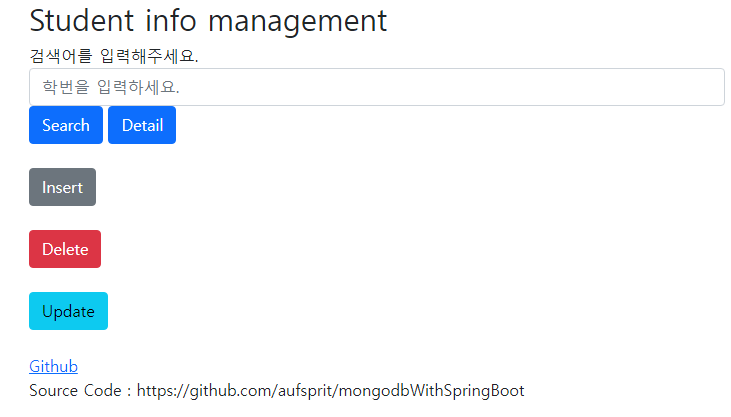
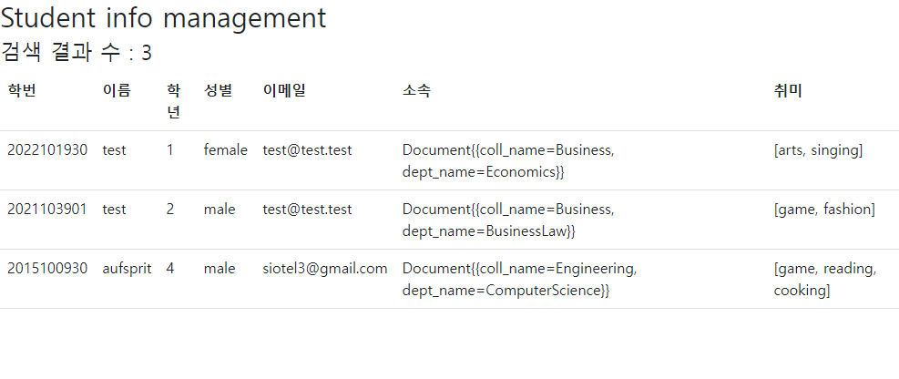

# mongodbWithSpringBoot

전에 mongodb를 이용하여 만들었던 학생 관리 프로그램을 Spring boot를 이용하여 구현해보기

그러면서 Spring boot와 mongodb를 공부하기

------
### 사용한 기술들
* Spring Boot
* Spring Web
* Spring Data MongoDB
* Lombok
* Handlebars

------
### 참조
#### Spring-MongoDB package-summary
* https://docs.spring.io/spring-data/mongodb/docs/current/api/org/springframework/data/mongodb/repository/package-summary.html

#### Spring-MongoDB reference
* https://docs.spring.io/spring-data/mongodb/docs/current/reference/html/

#### javatechonline blog << 아주 잘 설명되어있음
* https://javatechonline.com/mongodb/

---
### 데모
* https://mongodbwithspringboot-aufsprit.koyeb.app/
---
### 결과물

